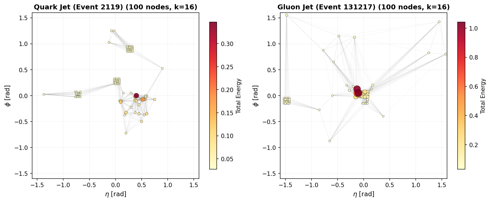
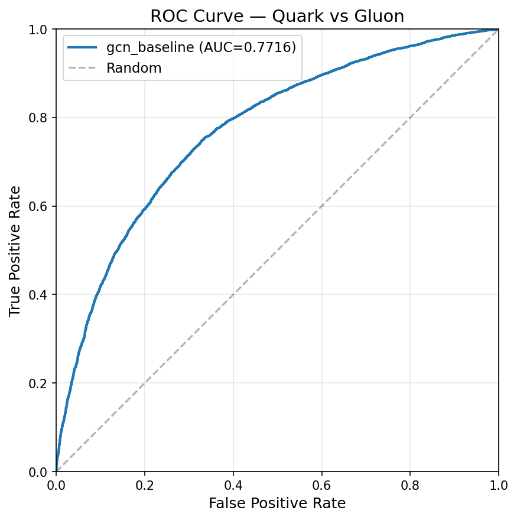
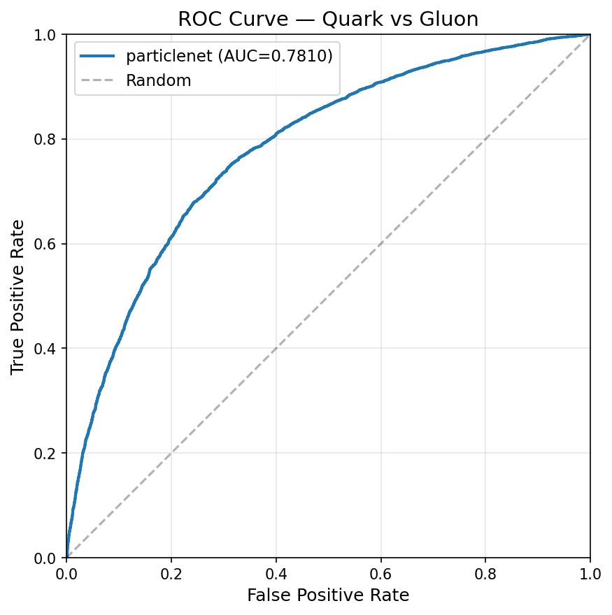
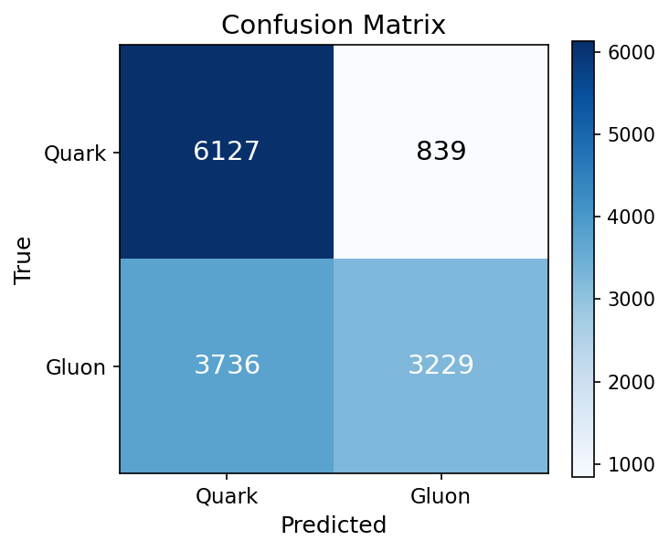
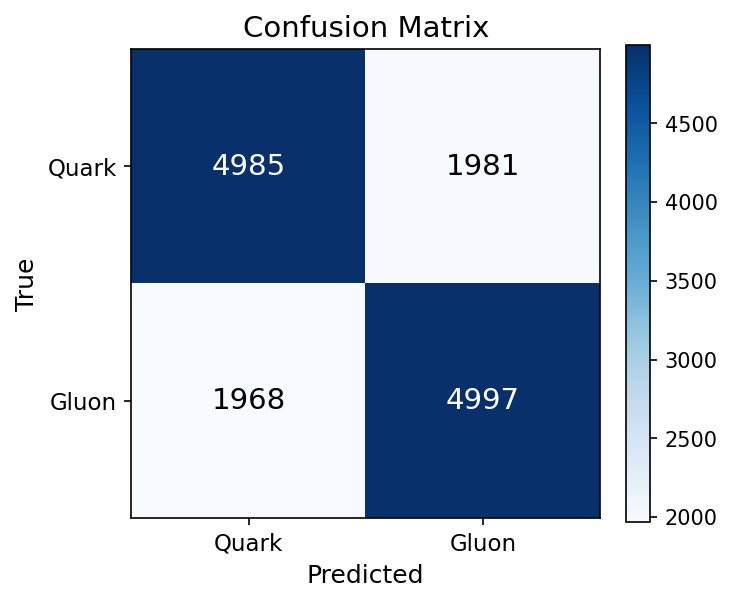
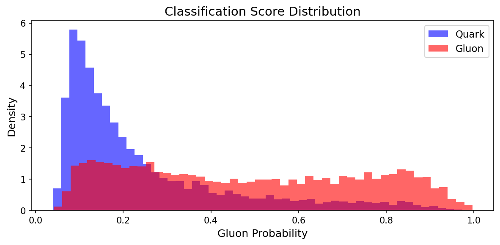
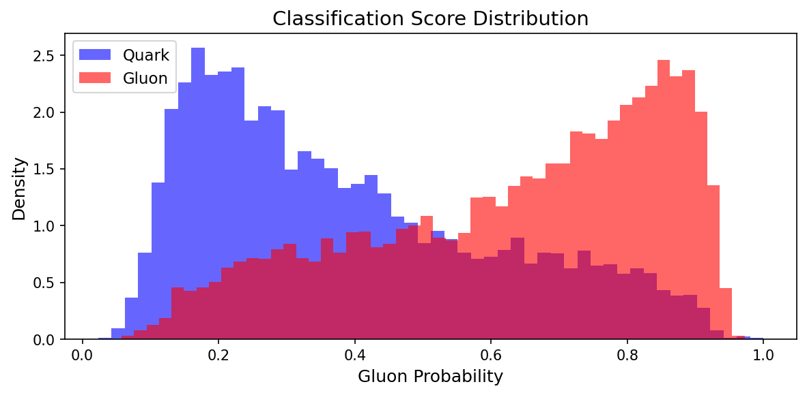

# Task 2: GNN Quark/Gluon Jet Classification

## Objective

Classify quark vs gluon jets using graph neural networks. Convert jet images to point cloud graphs and train GNN classifiers.

## Dataset

- **Source**: Same 139,306 CMS Open Data jet images as Task 1, converted to point clouds
- **Graph construction**: Non-zero pixels become nodes with features (Tracks, ECAL, HCAL), kNN edges (k=16) in (eta, phi) space
- **Split**: 80% train / 10% val / 10% test (stratified by label)

Two versions of the graph dataset were used:
- **Full graphs** (GCN): all non-zero pixels as nodes (~681 avg), raw feature values
- **Top-100 graphs** (ParticleNet): top-100 nodes by total energy, percentile-normalized features, avg 100 nodes

### Image-to-Graph Pipeline

Each 125x125x3 jet image is converted to a graph:
1. **Find non-zero pixels**: sum across 3 channels > 0
2. **Select top-100**: rank by total energy, keep highest 100
3. **Node features**: percentile-normalized (Tracks, ECAL, HCAL) values at each pixel
4. **Node positions**: pixel coordinates converted to physical (eta, phi) via `(idx - 62) * 0.025`
5. **Edges**: kNN (k=16) in (eta, phi) space, precomputed and stored in sharded `.pt` files
6. **Labels**: quark=0 (first 69,653), gluon=1 (last 69,653)

Note: this is an image-derived point cloud, not particle-level data. Each node represents a detector pixel, not an individual particle. Multiple particles may contribute to the same pixel, and one particle may deposit energy across multiple pixels. This means absolute AUC values will be lower than particle-level benchmarks (e.g., ParticleNet paper reports AUC ~0.91 on particle-level data).

## Models

### GCN Baseline

3-layer Graph Convolutional Network with input BatchNorm, global mean pooling, and Dropout(0.3):

```
InputBN(3) -> GCNConv(3, 128)+BN+ReLU -> GCNConv(128, 128)+BN+ReLU -> GCNConv(128, 128)+BN+ReLU
-> global_mean_pool -> FC(128, 64)+ReLU+Dropout(0.3) -> FC(64, 2)
```

- **Parameters**: 42,696
- **Training**: batch_size=256, lr=1e-3, split 80/10/10
- **Observations**: Val loss unstable (oscillates 0.64-1.28), likely due to GCN's sensitivity to variable graph sizes and lack of edge feature modeling. All neighbors weighted equally regardless of distance.

### ParticleNet (DynamicEdgeConv)

3 EdgeConv blocks with dynamic kNN (k=16), recomputed in feature space each layer. Each block has shortcut connections and uses max aggregation:

```
InputBN(3) -> EdgeConv(3->64)+shortcut -> EdgeConv(64->128)+shortcut -> EdgeConv(128->256)+shortcut
-> global_mean_pool -> FC(256, 256)+ReLU+Dropout(0.1) -> FC(256, 2)
```

- **Parameters**: 366,280
- **Training**: batch_size=128, lr=1e-3, split 80/10/10
- **Advantage**: Dynamic kNN adapts neighborhood structure as features evolve through layers, learning task-specific particle relationships rather than relying on fixed spatial proximity alone.

## Graph Visualization



Example graph representations of jet images. Each node is a top-100 energy pixel with kNN edges (k=16) in (eta, phi) space. Node size and color represent total energy. Left: quark jet. Right: gluon jet.

## Results

| Model | Params | Nodes | Features | Split | Batch Size | Val AUC | Test AUC | Test Acc | Epochs |
|-------|:------:|:-----:|:--------:|:-----:|:----------:|:-------:|:--------:|:--------:|:------:|
| GCN baseline | 42,696 | all (~681 avg) | raw | 80/10/10 | 256 | 0.766 | 0.772 | 67.2% | 20 (early stop, best@ep10) |
| **ParticleNet** | **366,280** | **top-100** | **percentile** | **80/10/10** | **128** | **0.776** | **0.781** | **71.7%** | **40 (early stop, best@ep30)** |

> **Note**: Due to time constraints, a full ablation study was not conducted. The two experiments differ in multiple variables (architecture, node count, feature normalization, batch size), so the results should be viewed as exploratory rather than a controlled comparison.

### ROC Curves

| GCN Baseline | ParticleNet |
|:------------:|:-----------:|
|  |  |

### Confusion Matrices

| GCN Baseline | ParticleNet |
|:------------:|:-----------:|
|  |  |

### Score Distributions

| GCN Baseline | ParticleNet |
|:------------:|:-----------:|
|  |  |

## Key Findings

1. **GCN training was notably unstable**: Val loss oscillated between 0.64 and 1.28 across epochs, and val AUC fluctuated between 0.70-0.77. Train loss decreased steadily (0.58→0.56), indicating the instability is on the generalization side. GCN treats all neighbors equally regardless of distance and has no edge feature modeling, which may contribute to inconsistent behavior across batches with varying graph sizes. ParticleNet training was stable in comparison, with val loss decreasing smoothly.

2. **GCN predictions are class-imbalanced**: The confusion matrix shows Quark recall=0.88 but Gluon recall=0.46 -- the model strongly favors predicting Quark. ParticleNet achieves balanced predictions (both classes at 0.72 precision/recall), suggesting DynamicEdgeConv learns more discriminative features for both jet types.

3. **ParticleNet outperforms GCN** by +0.9% AUC and +4.5% accuracy in our experiments. DynamicEdgeConv recomputes kNN in feature space each layer, which may help the model adapt neighborhood structure as it learns.

4. **Top-100 node filtering was needed for practical reasons**. Raw graphs average 681 nodes; ParticleNet with batch_size=256 at this scale caused GPU driver crashes. Filtering to top-100 by energy is within the particle multiplicity range used in literature (~30-100 particles per jet), though it discards low-energy deposits.

5. **Percentile normalization helped with GNN training**. Raw feature values span orders of magnitude (Tracks max=10.09, HCAL max=0.36); without normalization, kNN distance computation is dominated by high-value channels.

6. **Image-derived graphs differ from particle-level data**. Our AUC ~0.78 is lower than particle-level ParticleNet results (~0.91 reported in the original paper). This is expected since detector-level pixels merge multiple particles and introduce spatial discretization.

## File Structure

```
task2_gnn/
  README.md                  # This file
  dataset.py                 # Image -> point cloud -> graph pipeline
  model.py                   # GCN + ParticleNet models
  train.py                   # Training loop with stratified split
  evaluate.py                # Test metrics, ROC, confusion matrix
  configs/
    gcn_baseline.yaml
    particlenet.yaml

outputs/task2/
  gcn_baseline/              # GCN results + plots
  particlenet/               # ParticleNet results + plots
```

## References

- [ParticleNet: Jet Tagging via Particle Cloud Approach](https://arxiv.org/abs/1902.08570)
- [Semi-Supervised Classification with Graph Convolutional Networks](https://arxiv.org/abs/1609.02907)

## Running

```bash
# Build point clouds (top-100, percentile normalized)
python task2_gnn/dataset.py --build-pointclouds --top-n 100 --source percentile
python task2_gnn/dataset.py --build-edges --k 16

# Train
python task2_gnn/train.py --config task2_gnn/configs/particlenet.yaml

# Evaluate
python task2_gnn/evaluate.py --checkpoint outputs/task2/particlenet/best.pt
```
